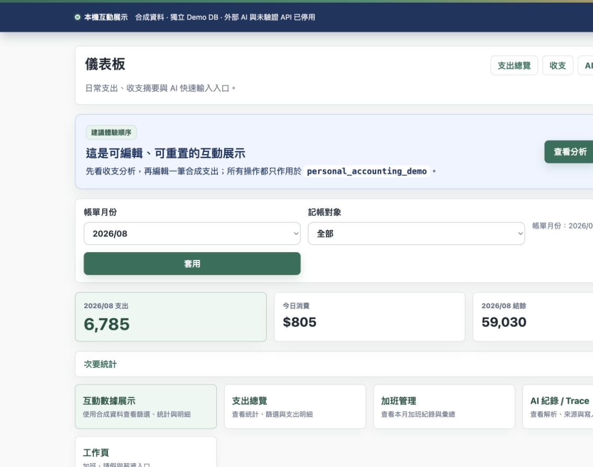
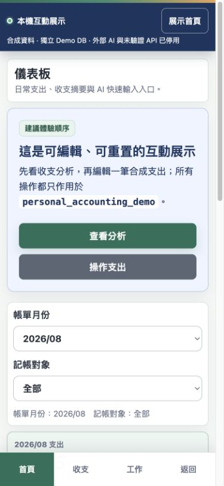

# Personal Accounting

A mobile-friendly personal accounting application built with PHP 8.2, MariaDB 11, Apache, and Docker Compose. It covers expenses, income, salary estimates, overtime, leave, analytics, PWA quick entry, and optional Gemini-assisted parsing.

> Public showcase repository: this repository contains only its clean public-only history and no private source history, real environment file, database backup, import file, or runtime log. See `PUBLIC_RELEASE_SCOPE.md` for the completed publication status and operating boundaries.

## Features

- Expense and income management with configurable payment methods and accounts
- Monthly salary, overtime, leave, and work-day settings
- Accounting-month calculation based on configurable settlement cycles
- Dashboard and filtered analytics
- Mobile-first administration pages and a lightweight PWA entry surface
- Optional Gemini parsing with server-side validation and trace records
- SQLite-focused tests plus Docker-based MariaDB runtime support

## Security boundary

- The default Compose port binds to `127.0.0.1` only.
- MariaDB has no host port mapping and is reachable only from the Compose network.
- Apache and PHP runtime logs use project-scoped Docker named volumes instead of being written into the source directory.
- Secrets belong in the root `.env`; `.env` is ignored by Git and Apache serves only `app/public`.
- `quick_entry.php` and `quick_entry_api.php` were designed for a trusted private network and are not authenticated public webhooks. Do not expose this application directly to the internet without adding an authorization layer, HTTPS, rate limiting, CSRF review, and abuse controls.
- `db-test.php` writes a diagnostic row. Maintenance and production-import scripts can modify data and must not be used against a real database without a backup and explicit review.
- Demo screenshots, fixtures, and deployments must use synthetic data only.

## Local setup

1. Copy the example environment file and replace every password placeholder.

   ```bash
   cp .env.example .env
   chmod 600 .env
   ```

2. Build and start the local stack.

   ```bash
   docker compose up -d --build
   ```

3. Run the idempotent schema migration.

   ```bash
   docker compose exec app php /var/www/html/scripts/migrate.php
   ```

4. Open `http://127.0.0.1:8080/` unless `APP_PORT` was changed.

Never run `docker compose down -v` unless permanent deletion of the local database volume is intended.

## Interactive local demo

The repository includes a real, isolated demo mode with synthetic accounting data. It does not use the normal database name, does not call Gemini, and disables the unauthenticated Quick Entry, Shortcut API, and database diagnostic endpoints.

All payment methods, accounts, entry-owner labels, transactions, and work records in Demo mode are synthetic. The reset command restores the fixed anonymous reference data as well as the transaction fixtures.

Start the demo with its dedicated Compose project name and public example environment:

```bash
docker compose \
  -p personal_accounting_demo_public \
  --env-file .env.demo.example \
  up -d --build

docker compose \
  -p personal_accounting_demo_public \
  --env-file .env.demo.example \
  exec app php /var/www/html/scripts/migrate.php

docker compose \
  -p personal_accounting_demo_public \
  --env-file .env.demo.example \
  exec app php /var/www/html/scripts/demo_reset.php
```

Open `http://127.0.0.1:18085/` and use:

- Username: `demo`
- Password: `demo-local-only`

The reset script deletes and recreates only synthetic rows inside `personal_accounting_demo`. It refuses to run unless `APP_ENV=demo`, `DEMO_MODE=1`, and both configured and connected database identities equal `personal_accounting_demo`.

The credentials in `.env.demo.example` are intentionally public local-demo values. Never reuse them for an internet-facing deployment.

## Synthetic demo screenshots

Desktop dashboard:



Mobile dashboard:



## Local checks

Run PHP syntax checks:

```bash
find app -name '*.php' -print0 | xargs -0 -n1 php -l
```

Run focused tests that do not require a live production database:

```bash
for test_file in app/tests/*Test.php; do php "$test_file"; done
```

Validate the exact public allowlist and scan the current tree for high-signal credentials, internal paths, and forbidden real-world Demo labels:

```bash
php app/scripts/public_release_check.php
```

After creating at least one local commit, scan every local Git blob—including unreachable objects—and every reachable historical path:

```bash
php app/scripts/public_git_history_check.php
```

The bundled GitHub Actions workflow uses read-only repository permissions, does not use secrets, checks out complete public history, does not start MariaDB or create Compose volumes, and runs the same release boundary, local Git-object scan, PHP lint, and focused-test checks in the project image.

Scripts that exercise MariaDB, Gemini, imports, or write paths have additional environment and database gates. Review each script before running it.

## Project status

This public showcase intentionally omits the private repository history, infrastructure paths, operational reports, real data, and production credentials. Its Git history starts from the reviewed public allowlist. The original application icon source and generation basis are documented in `ASSET_PROVENANCE.md`. See `PUBLIC_ALLOWLIST.txt` for the exact repository contents and `PUBLIC_RELEASE_SCOPE.md` for publication status and operating boundaries.

## License

This project is released under the MIT License. See `LICENSE`.
